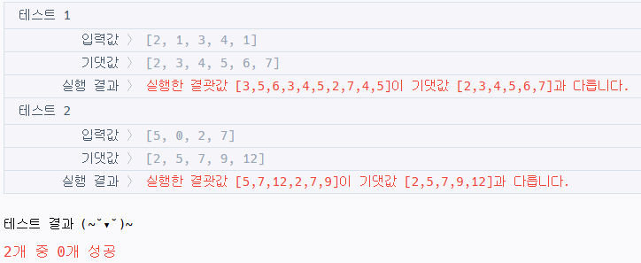
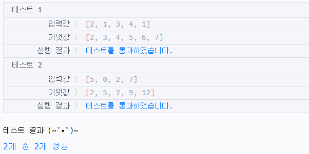
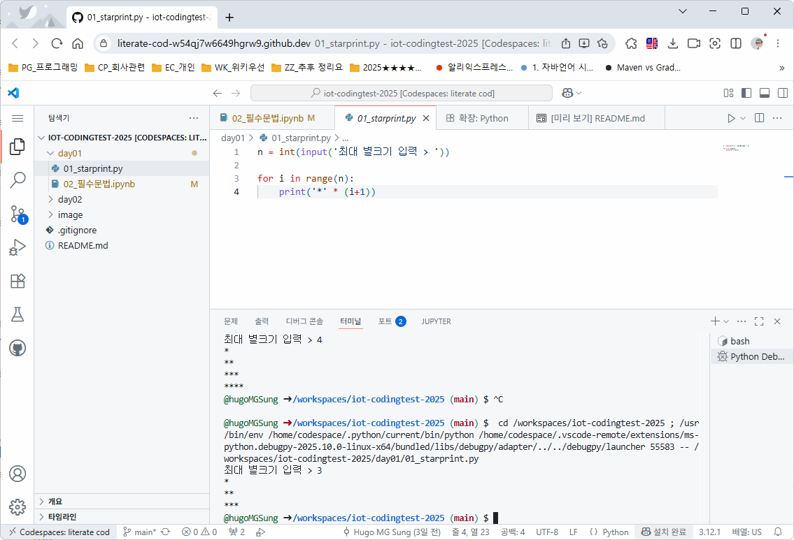

# iot-codingtest-2025
IoT 개발자 코딩테스트 준비 리포지토리

## 코딩테스트 이전

### VSCode 대체 에디터
- VS Code에 Plugin을 너무 많이 사용하면 메모리 과다 사용
- VS Code 대체 에디터
    1. VSCodium - https://vscodium.com/ 
        - VS Code 커스터마이징, VS Code와 동일한 기능 제공
    2. Cursor AI - https://cursor.com/
        - VS Code 커스터마이징, 바이브 코딩용
- VS Code에 MCP 플러그인 설치해도 Cursor AI와 동일하게 사용가능
- 메인은 VS Code, 서브로 Cursor나 VS Codium 사용 추천

### 코딩테스트 관련

### 추천 유튜브
- Do It 알고리즘 핵심 - https://www.youtube.com/watch?v=XncTU-4i1KI&list=PLFgS-xIWwNVX-zm4m6suWC9d7Ua9z7fuT
    - 코딩테스트 핵심이론
- 나동빈 파이썬 코테 - https://www.youtube.com/watch?v=m-9pAwq1o3w&list=PLRx0vPvlEmdAghTr5mXQxGpHjWqSz0dgC
    - 전반적인 개념 공부
- Do It 파이썬 코데 - https://www.youtube.com/watch?v=m2KpGo_-sGI&list=PLFgS-xIWwNVULwx1VA5IvpSqsXScpviN-
    - 백준을 타겟 문제풀이
- 프로그래머스 코테 파이썬 - https://www.youtube.com/watch?v=cJ9xdW_hqR4&list=PLlV7zJmoG4XJfK8vVL2E2NX8ej73vjNlh
    - 프로그래머스 타겟 문제풀이

### 코딩 테스트 합격자 되기 관련
- 네이버카페 - https://cafe.naver.com/dremdeveloper
- C++ 인프런 무료강의 - https://www.inflearn.com/course/cpp-%EC%BD%94%EB%94%A9%ED%85%8C%EC%8A%A4%ED%8A%B8-%ED%95%A9%EA%B2%A9?inst=a72dfff8&utm_campaign=inflearn_%ED%8A%B8%EB%9E%98%ED%94%BD_promotion-link&utm_medium=referral&utm_source=instructor
- 위키독스 강좌 - https://wikidocs.net/book/13314
- 깃헙 - https://github.com/dremdeveloper/codingtest_python

## 1일차 - 코딩테스트 시작

### 코딩테스트 언어
- C, C++, Java, JavaScript, `Python(3)`

### 코딩테스트 사이트
- 프로그래머스 - https://school.programmers.co.kr/
    - 카카오가 가장 많이 사용하는 코테 사이트
    - 기업 블라인트 테스트에 많이 사용
    - 바로 소스코드를 실행하면서 코테 가능
    - 프로그래머스 인증시험도 채용시 활용(PCCP, PCSQL)
- 백준 - https://www.acmicpc.net/
    - 가장 유명한 코테 사이트
    - 평가가 불편, 로컬에서 푼 소스코드를 올려서 점수를 확인하는 스타일
    - 커뮤니티가 다양
- 삼성 SW 아카데미 - https://swexpertacademy.com/main/capacityTest/main.do
    - 삼성그룹에서 SW직군 채용시 사용하는 코테 사이트

### 코테 준비

#### 언어 선택
- 기업 성향, 분류에 따라서 언어 선택
- 대부분의 일반 IT직군에서는 파이썬 사용

#### 기업별 선호 언어
- C++ : 삼성전자, LG전자, 한화시스템, LIG넥스원, 현대오토에버, 넥슨, 엔씨소프트, 크래프톤...
    - 임베디드 SW 회사... 회사내에서는 C를 많이 쓰지만 코테는 C++ 활용
- Java : 카카오, 토스, 쿠팡, 직방, 무신사...
- Python : 카카오, 네이버, 당근마켓, 배달의민족, 스타트업 전반...

#### 문제분석
- 쪼개서 분석 : 동작단위로 분리해서 분석할 것
- 제약사항 파악 : 문제를 풀기위해서 제약을 둠
- 입력값 파악 : 입력값의 크기에 따라 `시간복잡도`가 결정!
- 핵심키워드 : 알고리즘, 자료구조 선택

#### 프로그래머스
- 카카오가 가장 많이 사용하고 있는 코테사이트
- `자동완성 기능` 없음! VS Code에 익숙한 사람은 프로그래머스에서 연습을 더 해야함

##### 프로그래머스 사용법
1. https://school.programmers.co.kr/ 진입
2. 회원가입(생략)
3. 로그인 후 코딩테스트 메뉴
4. 스킬체크 시작
5. 문제풀이 화면(에디터)으로 변경. 힌트 확인

## 알고리즘 효율

### 복잡도!
- 복잡도(Complexity) : 얼마나 증가하는지를 나타내는 수학적 개념
    - 공간 복잡도 - 하나의 문제를 해결하는데 얼마나 많은 메모리를 사용하는지 
    - 시간 복잡도 - 하나의 문제를 해결하는데 얼마나 오랜 시간이 걸리는지

#### 제일 중요한 것은 시간 복잡도
- 문제를 해결(알고리즘이 동작)하는데 완료까지 걸리는 시간
- 최고, 보통, 최악으로 구분
- 여기서는 최악의 경우를 산정해서 파악

#### 시간 복잡도 표기법
- 빅오 표기법
- 수학에서 1,2,3,4,5,... m 이라고 할때 n을 의미
- n 대신 x로 표현할 수도 있음

|순번|시간복잡도|최대연산 횟수(1초당)|비고|
|--:|:--|--:|:--|
|1|$O(\log n)$|1,000,000,000|단일 for문 중간 연산을 빠지는 경우가 매우 많은 경우 (예: 369)|
|2|$O(n)$|10,000,000|for문 사용 / 반복문 하나 사용|
|3|$O(n \log n)$|1,000,000|2중 for문에서 반복문하나가 log n 횟수로 연산|
|4|$O(n^2)$|3,000|2중 for문|
|5|$O(n^3)$|300|3중 for문|
|6|$O(2^n)$|20|재귀호출, DFS, 백트래킹|
|7|$O(n!)$|10|팩토리얼, 순열탐색, 최적정렬법 찾기|

- 1번이 제일 빠르고, 7번이 제일 느리다

<!-- $$ O (\log n) $$ -->

#### 시간 복잡도 계산
- 실제 별찍기는 $O(n)$. 하지만 수학적으로 계산해보면 $O(n^2)$ 나올 수 있음
- 박테리아 계산도 16개를 매년 하나씩 줄어들면 16년이 걸릴 것을 예상(n)
    - 반씩 줄면 횟수가 더 많이 주는 것을 유추할 수 있음 $O(\log n)$

### 코테 파이썬 필수 문법
- [링크](./day01/02_필수문법.ipynb)

## 2일차 - 코테 정복시작

### 배열 
- 다른 언어와 달리 파이썬은 배열이 없음! 리스트 사용해서 배열로 대체 사용
- [링크](./day02/01_배열.ipynb)

#### 프로그래머스 코테 진행
1. solution.py 내 에디터에서 코딩 진행
2. `코드실행`
    - 실패

        

    - 성공

        

3. `제출 후 채점하기` 클릭
    - 테스트케이스 9번 반복
    - 하나라도 실패하면 통과 못함. 전부 통과

    

4. 다른 사람의 풀이 보기 가능(점수 차감X)

#### 모의 테스트
1. [두 개 뽑아서 더하기](https://school.programmers.co.kr/learn/courses/30/lessons/68644) 
2. [방문 길이](https://school.programmers.co.kr/learn/courses/30/lessons/49994)

### 스택
- LIFO: 맨 나중에 추가한 데이터가 가장 먼저 출력되는 구조
- push() : 데이터 삽입. 쌓여있는 데이터 마지막에 추가
- pop() : 데이터 추출. 쌓영있는 데이터 마지막에서 추출
- [링크](./day02/02_스택.ipynb)

## 3일차 - 코테 정복시작

### 깃헙 팁
- https://github.com/hugoMGSung 주소에 com -> dev
    - 브라우저 상에서 온라인 VS Code가 실행
    - 로컬 VS Code와 동일하게 사용가능
    - 처음 Ctrl + F5로 실행, CodeSpace 설정, CPU 2Core, 8Gb... 등 선택하고 코드스페이스 생성

    

### 스택
- 몸풀기 문제, 모의 테스트
- 제출 후 체점하기에서 print()문 제거 또는 주석처리할 것(효율성 테스트)
- [링크](./day03/01_스택.ipynb)

### 큐
- FIFO : 맨 먼저 삽입한 데이터가 가장 먼저 출력되는 구조
- enQueue() : 데이터 삽입
- deQueue() : 데이터 추출
- [링크](./day03/02_큐.ipynb)
